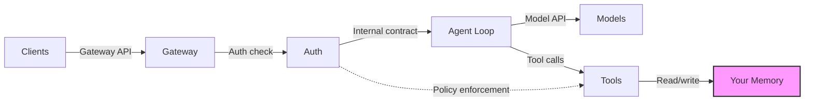

# Personal AI Architecture

[](LICENSE)

An open architecture for personal AI systems. Your data, your models, your rules. Zero lock-in by design, even to the system itself.

<p align="center">
  <a href="https://personalaiarchitecture.org">Website</a> · <a href="https://github.com/BrainDriveAI/braindrive">BrainDrive (built on this)</a> · <a href="docs/foundation-spec.md">Foundation Spec</a>
</p>

## Why This Exists

Every AI tool today owns your data. Your conversations, your context, your preferences, all trapped inside systems you don't control. Switching costs are the business model.

The Personal AI Architecture is designed so there are no users. Only owners.

- **Your Memory is the platform** — it depends on nothing; everything else depends on it. When the system isn't running, you can read and modify everything with standard tools.
- **Everything else is swappable** — models, tools, interfaces, auth, even the agent loop. Change your provider with a config edit. No code changes, no migrations, no lock-in.
- **Zero lock-in is enforced, not promised** — 8 architectural invariants, tested in CI, gated on every PR. 

## Architecture

Four components, two APIs, three externals. Every piece is independently replaceable.



| Layer | What | Role |
|-------|------|------|
| **Your Memory** | Files, conversations, history | The platform. Zero outward dependencies. |
| **Agent Loop** | Message → model → tools → response → repeat | Generic loop. No product logic. |
| **Gateway** | HTTP server, conversation management | Routes requests. Content-agnostic. |
| **Auth** | Identity, access control, policy | Cross-cutting. Independent of Gateway. |
| **Gateway API** | Clients ↔ Gateway | External contract. Any client that speaks it works. |
| **Model API** | Agent Loop ↔ Models | External contract. Any compatible model works. |
| **Clients** | Web, CLI, mobile, voice, bots | Anything that speaks the Gateway API. |
| **Models** | Cloud or local AI models | Accessed through adapters. Swappable by config. |
| **Tools** | MCP servers, CLI tools, native functions | Self-describing. Discovered at runtime. |

## See It In Action

[BrainDrive](https://github.com/BrainDriveAI/braindrive) is the first full implementation — a self-hosted personal AI system with a web interface, Docker install, and goal-oriented methodology. One-line install, MIT-licensed, ready to use.

If you want to see the architecture in production, start there. If you want to build your own, stay here.

## What You Get

This repository is a reference implementation and a validation suite that proves the architectural promises are real.

| Resource | What it is |
|----------|------------|
| [Foundation spec](docs/foundation-spec.md) | The complete architecture: components, contracts, principles, responsibility matrix |
| [Component specs](docs/) | Detailed specs for every component — Memory, Agent Loop, Gateway, Auth, Tools, Models |
| [OpenAPI + JSON Schema](specs/) | Machine-verifiable contracts for every API boundary |
| [Conformance tests](test/) | 212 tests proving swappability, local-first operation, and zero lock-in |
| [Blueprints](docs/blueprints/) | Execution-ready packages for every component: spec, schema, conformance tests, drift guard, implementation prompt |
| [Architecture primer](docs/ai/) | Token-optimized reference files for AI-assisted development — hand them to your AI agent and build |
| [Lock-in gate](docs/lockin-gate.md) | 8 checks enforced on every PR. If it creates lock-in, it doesn't merge. |

## Quick Start

### Use as a dependency

```bash
npm install personal-ai-architecture
```

```typescript
import {
  boot,
  createMemoryTools,
  createMemoryToolExecutor,
  createOpenAICompatibleAdapter,
  createEngine,
} from "personal-ai-architecture";

const { config, adapterConfig } = await boot();

// Or compose manually
const memoryTools = createMemoryTools("/path/to/your/memory");
const toolExecutor = createMemoryToolExecutor(memoryTools);
const provider = createOpenAICompatibleAdapter({
  name: "openrouter",
  base_url: "https://openrouter.ai/api/v1",
  api_key: process.env.OPENROUTER_API_KEY!,
  default_model: "anthropic/claude-sonnet-4",
});
const engine = createEngine(provider, toolExecutor);
```

### Run standalone

```bash
export OPENROUTER_API_KEY=sk-or-v1-...
npx personal-ai
```

### Validate the architecture (no API key needed)

```bash
npm install
npx tsx scripts/acceptance-check.ts   # Swap provider, move memory, add tool
npm run test:conformance              # Architecture invariants + lock-in gate
npm test                              # Full suite (unit + integration + conformance)
```

The runtime falls back to mock mode when no API key is available, so local validation always works.

## Documentation

| I want to... | Start here |
|--------------|------------|
| **Understand the architecture** | [Foundation spec](docs/foundation-spec.md) — the complete architecture in one document |
| **Know what to build** | [Implementer's reference](docs/guides/implementers-reference.md) — distilled contract, no rationale |
| **Build with AI assistance** | [Architecture primer](docs/ai/) — token-optimized files to hand your AI agent. Compliance matrix, component primers, audit playbooks, canonical examples. |
| **Build a component** | [Blueprints](docs/blueprints/) — spec, schema, conformance tests, drift guard, and implementation prompt per component |
| **Verify conformance** | [Conformance guide](docs/guides/conformance/) — architectural invariant test suite |
| **Check for lock-in** | [Lock-in gate](docs/lockin-gate.md) (PR checks) · [Lock-in audit](docs/lockin-audit.md) (milestone checks) |

For AI agents: start with [AGENT.md](AGENT.md) — architecture overview, lock-in checks, vocabulary, and file map in one machine-readable document.

## Configuration

Four fields:

| Field | Description |
|-------|-------------|
| `memory_root` | Path to your memory folder (files + SQLite conversations) |
| `provider_adapter` | Adapter name — matches `adapters/{name}.json` |
| `auth_mode` | `"local"` for V1 owner-only auth |
| `tool_sources` | Directories to scan for `tool.json` manifests |

Two adapters included: **openrouter** (cloud models via [OpenRouter](https://openrouter.ai)) and **ollama** (local models via [Ollama](https://ollama.com)). Both use the OpenAI-compatible format, so any compatible endpoint works.

### Swap your provider

Change `provider_adapter` in config. Set the API key. No code changes.

### Move your memory

Copy the folder. Update `memory_root`. Everything works — files, conversations, history.

### Add a tool

Drop a `tool.json` in any `tool_sources` directory:

```json
{
  "name": "get_weather",
  "description": "Get current weather for a city",
  "parameters": {
    "type": "object",
    "properties": { "city": { "type": "string" } },
    "required": ["city"]
  }
}
```

Restart. The tool is discovered automatically.

## Testing

```bash
npm test                    # Full suite (unit + integration + conformance)
npm run test:conformance    # Conformance + lock-in gate
npm run check:imports       # Import boundary verification
npm run check:lockin        # Zero lock-in grep check
npm run baseline            # Build + tests + lint + imports + lock-in + docs
```

Validation scripts for individual components:

```bash
npx tsx scripts/acceptance-check.ts  # 3 acceptance tests (no API key needed)
npx tsx scripts/server-check.ts      # Full server test with real model
npx tsx scripts/engine-check.ts      # Agent loop
npx tsx scripts/memory-check.ts      # Memory tools
npx tsx scripts/auth-check.ts        # Auth
npx tsx scripts/provider-check.ts    # Provider connectivity
```

## License

MIT — see [LICENSE](LICENSE).
