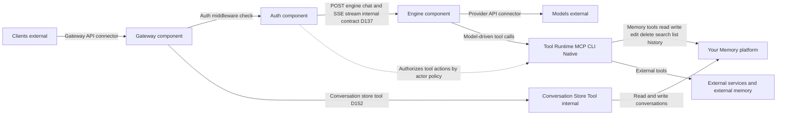
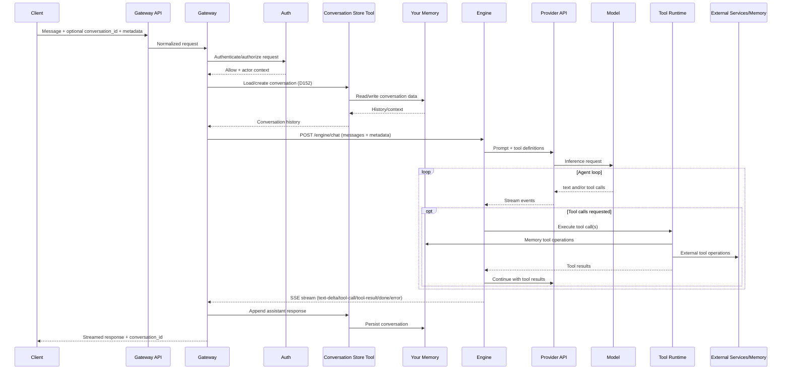

# The Architecture

The Personal AI Architecture is MIT Licensed, and designed to ensure that the power of AI belongs not to a few Big Tech companies, but to the people.

It is not a personal AI system — it is the architecture you build one on top of. 

An architecture with one goal: avoid lock-in.

Lock-in to a vendor. Lock-in to a specific technology choice. And even lock-in to The Architecture itself.

It does this by making the one thing you *do* want to be locked into the foundation of the entire system: **Your Memory**.

### Your Memory is the Platform

Everything else — the AI models you use, the engine that calls the tools, auth, the gateway, even the internal communication layer — is decoupled and swappable.

This matters for two reasons:

### 1. It puts you back in control

Your conversations, your preferences, your context are currently trapped inside software you don't control. Locking you inside their systems is Big Tech's business model. Your their user, and often times you are also their product.

The Architecture is designed so there are no users. Only owners.

### 2. It allows you to adapt at the speed of AI

An architecture that bets on today's stack is an architecture with an expiration date.

Keeping all components decoupled and easily swapable allows your AI system to adapt at the speed of AI.

Here's how it works. Four components, two connectors, three external dependencies:

### Your Memory — the platform

The defining property of this architecture: Your Memory has zero outward dependencies. Every other component depends on it. It depends on none of them.

This is what makes personal AI personal. Most AI systems are app-centric — your data lives inside the application, locked to its formats, its APIs, its business model. Remove the app, and your data is gone or useless.

Here, Your Memory is the platform. Engine, Auth, Gateway, clients, models, tools — all built on top, all replaceable. Your Memory persists when everything else is swapped, upgraded, or removed. It stays independently inspectable with standard tools (text editor, file browser, database viewer) even when the system is not running.

This is also what compounds. Every conversation, every decision, every plan makes the system more powerful — because it makes your memory richer. As AI capabilities grow, the value of what it draws from grows with it. This is how you ride the AI wave, instead of being washed away by it.

Nothing else creates lock-in. Every component accesses Your Memory exclusively through tools — the model through the Engine's tool loop, infrastructure components through dedicated internal tools for their operational needs. Storage can evolve without anything else changing. The contract is the tools, not the storage. This ensures your AI system remains yours.

See `memory-spec.md`.

### AI Model(s)

In a biological brain, memory and intelligence are fused — you can't upgrade your neurons or swap in better reasoning. You're stuck with both. A digital brain doesn't have that constraint. Your Memory persists as the platform. Intelligence arrives fresh through the Provider API — pluggable, swappable, upgradeable. Different models for different tasks, from any provider or your own, swapped with a config change. The brain reconstitutes from the same Memory with better intelligence every time a better model ships.

This is the superpower a digital brain has over a biological one. The fastest-changing part of AI — model capability — is the cheapest thing to change in this system. You ride the breakneck pace of AI model improvement instead of being left behind.

See `models-spec.md`.

### Engine

A brain is a powerful thing, but give it hands that can hold tools and there's no limit to what it can do. The Engine is those hands — it connects AI models to tools, decides which to use, and executes them. Read a file, call an API, search a library, control a browser — anything the system can do.

New capabilities arrive by adding tools, not by changing the engine. This means the system absorbs the pace of change, instead of chasing it.

Everything that makes a product unique (methodology, personality, skills, folder structure) lives in Memory, not the Engine. The Engine is intentionally generic — a commodity component. Product behavior emerges from what's in the files.

See `engine-spec.md`. For tools, see `tools-spec.md`.

### Auth

Auth protects your memory. Every request passes through it, independent of the Gateway and Engine. You control who and what has access — today that's you, but the foundation is built for multi-actor access and AI agents acting on your behalf, each with exactly the permissions you grant.

See `auth-spec.md`.

### Gateway

The Gateway is how the outside world connects — web app, CLI, mobile app, bot. It speaks one protocol (the Gateway API) allowing any client to plug in.

This means no interface lock-in. Your AI meets you where you already are — browser, terminal, mobile, Slack, and whatever comes next.

Conversations live in the system, not in any client — start on web, continue on mobile, pick up on CLI.

See `gateway-spec.md`.

### Communication

The architecture is designed to avoid lock-in — and that includes lock-in to the communication layer. Like everything else in this system besides Your Memory, it must remain swappable.

A communication layer that's accumulated other components' responsibilities is one you're stuck with. A communication layer that stays thin, stateless, and dumb is one you can swap without consequences.

Two kinds of communication, two kinds of lock-in protection:

#### External — Two Contracts

Components connect to the outside world through two connectors:

1. The Gateway API - how clients connect
2. The Provider API - how the Engine connects to models.

Between each contract and the external world sits an adapter — a thin translation layer you own. Your components speak a stable internal interface. The adapter translates to whatever external standard is current. Standard changes? Swap the adapter. Your components never knew the difference. The internal interface isn't sacred either — you own it, you can change it too.

New model? Config change. Better engine? Swap it. New client? Point it at the same API. New standard? Swap the adapter. The cost of adopting anything new is one swap, not a rebuild.

See `gateway-spec.md`, `models-spec.md`, `adapter-spec.md`.

#### Internal

Components also communicate internally — Gateway to Engine, Auth middleware on the request path, Engine to tools. These aren't connectors. They're internal interfaces between components in the same deployment.

To avoid lockin, the communication layer must only carry, and not interpret signals. Memory holds state, the model makes semantic decisions, Auth controls access. Communication does none of those things. When a responsibility leaks from its owner into the communication layer, it recouples the system — swapping communication now means dealing with work that doesn't belong to it.

See `communication-principles.md`.

---

## Deployment Model

If you can't run the system on your own hardware, you don't fully own it. The foundation defines how the system runs on **hardware the owner physically controls** — your laptop, your desktop, your home server. Full offline capability, local data storage, no cloud service required. The system has dependencies (model provider, runtime) but none are inescapable — each has an escape path defined in `deployment-spec.md`. Everything above — Your Memory as the platform, swappable components, two contracts — is theoretical if the system can only run on someone else's infrastructure. Deployment is where ownership becomes concrete.

Managed hosting, VPS, and remote access are Level 2 product extensions — same code, different deployment. Memory portability means you move between deployment modes without losing anything. See `deployment-spec.md` for the full contract.

---

## Architecture Principles

Five principles enforce the architecture:

1. **Memory Is the Platform** — Everything else exists to serve Memory. The most portable, most independent, most durable part of the system. No other component should create dependencies that make Memory hard to move.
2. **Everything Else Is Swappable** — Engine, Auth, Gateway, clients, models, tools, contracts, hosting — all replaceable. Memory via tools, components via contracts, contracts via adapters. Every piece is a drop-down menu, not a permanent choice.
3. **Interfaces Over Implementations** — Every component is defined by what it does, not how it works. The Engine calls tools — it doesn't know if Memory is files or a database. This is what makes one-component swaps possible.
4. **Complexity Is Lock-In** — If the system requires a team of developers, you're locked in to that team. That's a dependency as real as any vendor. The entire system must be understandable and maintainable by one developer + AI coding agents. Four components and two connectors isn't minimalism — every additional component is a potential expertise dependency.
5. **Start Constrained, Expand Deliberately** — Products built on this don't have to use all capabilities at once. Each expansion — broader scope, more tools, external integrations — is a deliberate step.

**Nothing enforces these principles.** You can bypass adapters, hardcode a provider, or couple components directly — the system still works. But every violation is a lock-in you've chosen to accept. The architecture makes the zero-lock-in path the easiest path, not the only path.

---

## What Crosses the Contracts

Both connectors are deliberately hollow — they exist to pass information forward with minimal opinion. The less they do, the more they survive.

### Gateway API — Clients ↔ Gateway

How the world interacts with the system. Built on whatever the best industry standard is today — someone else maintains the protocol, you just use it. Swappable via adapter when the standard shifts. Level 2 products choose the specific format (see `adapter-spec.md`).

- **In:** Message content + conversation ID (optional) + metadata (client context, scope info)
- **Out:** Streamed response + conversation ID + message record

See `gateway-spec.md`.

### Provider API — Engine ↔ Models

How the system thinks. Today that means model-native tool calling — tool definitions sent with prompts, tool calls returned in completions. But the Provider API is a connector with an adapter, not a permanent commitment to this pattern. Better approach emerges? Swap the adapter.

- **In:** Prompt (system instructions + conversation + tool definitions + context)
- **Out:** Streamed completion (text + tool calls)

See `models-spec.md`.

**What about tools?** Tool calls flow through the Provider API and are executed by the Engine. How the Engine communicates with tools — MCP today, something better tomorrow — is internal to the Engine, not an architectural boundary. No separate tool protocol connector at Level 1. Memory tools are internal — the system can't function without reading and writing its own memory. External tools (Salesforce, weather, APIs) are additive — add or remove them without affecting the system. See `tools-spec.md`.

**The memory/tool binary.** Everything the system processes reduces to two things: memory and tools. If it's data, it's memory. If it's not data, it's a tool. New capabilities arrive by adding tools and memory content, not by adding infrastructure. See `research/memory-tool-completeness.md`.

### Internal Interface: Gateway ↔ Engine

The Gateway ↔ Engine handoff is the one internal interface that needed definition — not a third connector, just a contract between two components in the same deployment.

Gateway POSTs a request (messages + metadata) to the Engine, Engine returns an SSE stream (text, tool calls, results, completion). Auth middleware sits on the path. See `gateway-engine-contract.md` for the full contract.

---

## Foundation User Stories

These stories validate the architecture itself. Product-level user stories are defined in the product spec (Level 2).

| # | Story |
|---|-------|
| FS-1 | **Move Your Memory to a new system** — export, import on fresh deployment, preferences honored, nothing lost |
| FS-2 | **Add a capability without violating the architecture** — add a tool, skill, client, or provider. Memory gains no dependencies. Four-component structure holds. |
| FS-3 | **Run on your own hardware** — install on laptop, desktop, or home server. No external service required. Full offline capability. |
| FS-4 | **Swap a model provider** — config change, next message uses new provider, nothing else changes |
| FS-5 | **Swap the client** — new client speaks Gateway API, system serves it identically |
| FS-6 | **Evolve Memory** — add semantic search alongside file search, no other component changes |
| FS-7 | **Swap the Engine** — replace it, everything else unaffected |
| FS-8 | **Expand scope via tools** — add tools to grow from library → filesystem → services |

---

## How the Architecture Evolves

The product roadmap follows an expanding sphere of agent capability. Each step is additive — only tools change:

| Phase | Scope | What's Added |
|-------|-------|-------------|
| **V1** | Library folder | Library-scoped file tools |
| **V2** | Your computer | System tools (filesystem, apps) |
| **V3** | Anything on a computer | External tools (APIs, services) |
| **V4** | Beyond your computer | Inbound integrations |

**Add tools, don't change architecture.** Scope is a tool configuration decision, not an architecture decision.

---

## Foundation Decisions

These decisions define the architecture. Product-level decisions (what ships when, UX specifics) belong in product specs.

| # | Decision | Rationale |
|---|----------|-----------|
| D15 | Product clients are product-owned, not coupled to the Engine | The client is the product's brand. Decoupling from the Engine means the product controls the experience AND the client is swappable. |
| D16 | Zero custom protocols — use the prevailing industry standard, not a proprietary one | Never invent a protocol when an existing one will do. Swappable via adapter when the standard shifts. |
| D20 | Client metadata flows through the Gateway API contract | Client sends context, Gateway passes it through, Engine uses it. |
| D22 | Auth on both local and managed hosting | Auth is a memory concern (who can access your system), not a hosting concern. |
| D23 | Managed hosting is stricter, not just easier | Same code, different configuration. Managed hosting restricts tool access and enforces policies through configuration, not code forks. |
| D24 | Engine ceiling must match Claude Code / Open Claw | The architecture must never be the bottleneck. If the Engine caps out, we swap it — because the contracts make that possible. |
| D26 | Skill execution = multi-turn, adaptive, judgment-based | Skills are NOT scripts. The model must support real agentic behavior. This is the minimum bar. |
| D39 | The Engine is a generic agent loop with no product-specific logic | Composability. A generic engine picks up any tool. A domain-specific engine only picks up domain-shaped things. |
| D40 | Prompt assembly and skill execution live in Memory, not the Engine | Product behavior emerges from what's in the files, not from custom engine code. |
| D51 | Tools are not a component — they are capabilities in the environment | Every concern maps to existing components: definitions in Memory, execution in Engine, permissions in Auth. |
| D53 | Tool Protocol connector is not needed — tool calls flow through the Provider API | No gap between the Provider API and the Engine's execution. Two connectors, not three. |
| D57 | The client is not a component — it's any external client | The system is Your Memory + Engine + Auth + Gateway. Clients connect to it through the Gateway API. |
| D58 | Gateway is a new component — manages conversations and routes to the Engine | Without the Gateway, conversation management would violate Engine genericity (D39) or Memory unopinionatedness (D43). |
| D60 | Auth is a cross-cutting layer — independent of the Gateway | Auth and Gateway don't know about each other. Both can be swapped independently. |
| D63 | Models are not a component — they are external intelligence | The system calls a model through the Provider API. It doesn't contain one. |
| D64 | Four components, two connectors, three external dependencies | The final architecture resolved through six component interviews. |
| D65 | Level 2 is composable lego blocks — each piece independently usable | A Level 2 product is a box of legos, not a monolith. No piece requires another piece. |
| D135 | Memory/tool binary — if it's data, it's memory; if it's not data, it's a tool | Everything is either a noun (memory) or a verb (tool). New capabilities compose from existing primitives. "Your Memory" (D138) distinguishes the component from the concept. |
| D137 | Gateway ↔ Engine is a plain HTTP API contract — not a third connector | One internal endpoint between two components we control. See `gateway-engine-contract.md`. |
| D138 | Memory component renamed to "Your Memory" | Distinguishes the component (your owned local storage) from the concept (all data is memory per D135). |
| D139 | Contracts are swappable via adapters — completing zero-lock-in | Components via contracts, contracts via adapters, Memory via tools. The swappability chain is structurally complete. See `adapter-spec.md`. |
| D143 | Configuration is a cross-cutting concern with its own spec | Not owned by any single component. Three categories: preferences (Your Memory), runtime config (thin bootstrap), tool self-description. See `configuration-spec.md`. |
| D148 | Level 1 defines local deployment only — managed hosting is Level 2 | The foundation defines how the system runs on hardware the owner controls. Managed hosting is a product offering layered on top. See `deployment-spec.md`. |
| D147 | Anti-lock-in CI test — three swaps must succeed with config-only changes | Provider swap, model swap, tool swap. If any requires code changes, lock-in has been introduced. CI-testable on every release. |

Product-level decisions (D17 tool scope, D18 single-model path, D19 digest timing, D21 approval UX, D25 starter content) belong in the product spec. Architectural decisions are tracked in the BrainDrive Library.

---

## Responsibility Matrix

Who does what — and who doesn't. Use this to verify that component specs don't claim responsibilities that belong elsewhere.

| Responsibility | Owner | NOT |
|---|---|---|
| Persist, retrieve, search, version data | **Your Memory** (via tools) | |
| Provide structure (paths, hierarchy) | **Your Memory** provides it | Model/owner decides what goes where |
| Understand content, make meaning | **Model** | Your Memory, Engine |
| Assemble prompts (rich instructions) | **Model** reads from Your Memory | Engine, Your Memory |
| Select context (decide what to read) | **Model** | Your Memory, Engine |
| Summarize, associate, consolidate | **Model** using Your Memory operations | Your Memory |
| Execute tools | **Engine** | Your Memory |
| Decide which tools to use | **Model** (via Engine loop) | Your Memory, Gateway |
| Execute skills | **Model + Engine** (model reads skill files, Engine executes tool calls) | Your Memory |
| Protect access / control permissions | **Auth** | Your Memory, Gateway |
| Manage conversations | **Gateway** | Engine, Your Memory |
| Route requests to Engine | **Gateway** | Auth |
| Connect to AI models | **Provider API** (connector) | Engine internals |
| Accept client connections | **Gateway API** (connector) | Engine |
| Provide intelligence | **Models** (external) | Engine, Your Memory |
| Display content to owners | **Clients** (external) | Gateway |
| Bootstrap the system | **Runtime config** (thin bootstrap — 4 fields, see `configuration-spec.md`) | Your Memory |
| Resolve concurrent writes | **Tool implementations** | Your Memory component |

---

## Related Documents

| Document | Relationship |
|----------|-------------|
| `memory-as-platform.md` | Why memory is the architectural center |
| `engine-spec.md` | Engine — generic agent loop |
| `memory-spec.md` | Your Memory — unopinionated substrate |
| `auth-spec.md` | Auth — cross-cutting identity and access control |
| `gateway-spec.md` | Gateway — conversations and routing |
| `tools-spec.md` | Tools — not a component or connector |
| `models-spec.md` | Models — external intelligence |
| `security-spec.md` | Security — threat model, enforcement, data protection |
| `adapter-spec.md` | Adapters — swappable contracts |
| `gateway-engine-contract.md` | Gateway ↔ Engine internal contract |
| `communication-principles.md` | Communication — six principles for lock-in-free internal communication |
| `configuration-spec.md` | Configuration — preferences, runtime, tool self-description |
| `deployment-spec.md` | Deployment — local-first contract |
| `customization-spec.md` | How Level 2 products build on the Foundation |
| Decisions log (BrainDrive Library) | All pivot decisions (D1-D168 + D141-refined) |
| `research/memory-tool-completeness.md` | D135 completeness proof — memory/tool binary |
| `guides/` | Developer guides, contracts, conformance tests, stubs |
| `research/` | Evaluations, analysis, and supporting research |

---

## Changelog

| Date | Change | Source |
|------|--------|--------|
| 2026-03-07 | Added architecture diagrams: flowchart (system topology) and sequence diagram (request lifecycle). Mermaid rendering enabled. | Dave J (diagrams) + Dave W + Claude |
| 2026-03-07 | Added Communication section (External — Two Contracts + Internal) replacing standalone Two Contracts section. Added communication-principles.md to architecture specs list and Related Documents. | D169 promotion (Dave W + Dave J + Claude) |
| 2026-03-01 | Codex cross-reference audit fix: Deployment Model wording — "no external dependencies required" → "no cloud service required" + "dependencies exist but none are inescapable." Aligns with deployment-spec which explicitly names model provider and container runtime as dependencies with escape paths. | Codex audit (Dave W + Claude) |
| 2026-03-01 | "No users, only owners" language pass: user -> owner in responsibility matrix | Ownership model alignment (Dave W + Claude) |
| 2026-03-01 | Cross-doc consistency review: added Developer Guides subsection to Related Documents (implementers-reference, contracts, conformance suite, guides-spec). | Cross-doc review (Dave W + Claude) |
| 2026-03-01 | D152: Added infrastructure caller sentence to §Your Memory — "infrastructure components through dedicated internal tools for their operational needs." | Architecture review (Dave W + Claude) |
| 2026-02-28 | Conciseness pass — trimmed decisions rationales, restructured Related Documents, tightened Internal Interface/User Stories/Evolution sections. | Review session (Dave W + Claude) |
| 2026-02-27 | D135 (memory/tool binary), D138 ("Your Memory" rename), D139 (adapters), D143 (configuration), D147 (anti-lock-in CI test), D148 (Level 1 local only) added to Decisions Made. | Architecture discussions (Dave W + Claude) |
| 2026-02-23 | Initial foundation spec created from architecture discussions. | Dave W + Claude |

---

*This document defines the architecture — the four components, the two connectors, the three external dependencies, and why this system can evolve as fast as AI does. Product specs define what's built on this foundation. The pivot spec defines why we chose this direction.*

