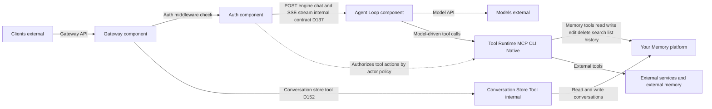

# Implementer's Reference

> Implementation contract for the Personal AI Architecture.
> No rationale, no history -- only what you need to build against.

---

## Architecture Overview

**4 components**, **2 APIs**, **3 externals**.



| Layer | Elements |
|-------|----------|
| Components | Your Memory, Agent Loop, Auth, Gateway |
| APIs | Gateway API (clients <-> Gateway), Model API (Agent Loop <-> Models) |
| Externals | Clients, Models, Tools |

---

## Components

### Your Memory (the platform)

**Zero outward dependencies.** Every other component depends on it; it depends on none.

| Property | Requirement |
|----------|-------------|
| Dependencies | None -- readable with standard tools when all components are stopped |
| Exposure | Through tools only (internal tools = the system's own interface to its platform) |
| Inspectability | Must be inspectable without the system running (text editor, file browser, database viewer) |
| Export | Must support full export in open formats from day one. Even if the implementation is a simple archive of the memory root, export is non-negotiable. |
| Version history | Must be reliably established at startup. If version history cannot be initialized, fail startup -- do not degrade to a warning. |

**Core operations:** read, write, edit, delete, search, list, history

`history` must return change records **and** previous states, not just metadata. Accept an optional commit/version identifier to retrieve file content at that point in time.

**Storage mechanisms (out of the box):**

| Mechanism | Implementation |
|-----------|---------------|
| Files | Markdown, plain text |
| Version control | Git |

Implementations can add storage mechanisms as needed (SQLite for structured queries, vector indexes for semantic search, etc.). Adding a mechanism means adding tool implementations — it doesn't change the contract. See `memory-spec.md` §Evolution.

**Substrate test:** If it stores/retrieves/searches/versions data, it belongs to Your Memory. If it interprets or produces content, it belongs to the model.

**Skills** are prompts stored in Your Memory. The model reads and follows them.

### Agent Loop (generic agent loop)

Generic, commodity, no product-specific logic.

**Loop:** accept message -> send to model -> execute tool calls -> stream response -> repeat until the model signals completion.

| Property | Requirement |
|----------|-------------|
| Configuration | Pre-configured at boot with tool definitions and provider config (not per-request) |
| Concurrency | Must handle multiple concurrent loops independently |
| Scope | Connects models to tools -- nothing else |
| Iteration cap | The Agent Loop MUST NOT impose a default iteration cap. Implementations MAY configure a safety bound as a deployment choice. |
| Text preservation | When the model emits text and tool calls in the same turn, the Agent Loop must preserve the text in the assistant message for the next loop iteration. Do not discard streamed text on tool continuation. |

**The Agent Loop does NOT:**

- Construct prompts
- Manage skills
- Handle approval state
- Enforce scope
- Decide context
- Persist conversations
- Authenticate
- Have personality

### Auth (cross-cutting layer)

Independent of Gateway -- both are swappable independently.

**Three operations:**

| Operation | Signature |
|-----------|-----------|
| Authenticate | request -> identity |
| Authorize | (identity, resource, action) -> allow/deny |
| Manage | modify permissions |

**Middleware position:** Sits between Gateway and the Agent Loop. Validates via headers, rejects unauthorized with 401.

**Headers:** `X-Actor-ID`, `X-Actor-Permissions`

**Actor types:** owner, collaborator, system agent, background agent, external agent, service, economic actor, federated

**Policy model:** `(subject, resource, action) -> effect`

**Minimal tool surface (required from day one):**

| Tool | Returns |
|------|---------|
| `auth_whoami` | Current actor identity |
| `auth_check` | Permission decision for a given resource/action |
| `auth_export` | Auth configuration minus credentials |

Data format is product-owned, not provider-specific.

### Gateway (conversations and routing)

Manages conversations and routes to the Agent Loop. Content-agnostic, interface-agnostic.

**Operations:** create conversation (implicit on first message), list, resume, history

**Guarantees:** route, persist conversations, resume, stream, content-agnostic, interface-agnostic

Stores conversations in Your Memory.

**Gateway does NOT:**

- Interpret messages
- Execute tools
- Authenticate
- Influence model behavior
- Route to models
- Transform content
- Inject context
- Rate limit
- Filter content

---

## API Contracts

### Gateway API (Clients <-> Gateway)

How the world interacts with the system.

| Direction | Payload |
|-----------|---------|
| In | Message content + conversation ID (optional) + metadata |
| Out | Streamed response + conversation ID + message record |

Built on prevailing industry standard. Swappable via adapter.

### Model API (Agent Loop <-> Models)

How the system thinks.

| Direction | Payload |
|-----------|---------|
| In | Prompt (system instructions + conversation + tool definitions + context) |
| Out | Streamed completion (text + tool calls) |

Model-native tool calling is the current approach. Swappable via adapter.

---

## Internal Contract: Gateway <-> Agent Loop

One HTTP endpoint. Not a third API.

### `POST /engine/chat`

**Request:**

```json
{
  "messages": [
    { "role": "system", "content": "..." },
    { "role": "user", "content": "..." }
  ],
  "metadata": {
    "conversation_id": "conv_abc123",
    "correlation_id": "req_xyz789",
    "trigger": "message",
    "client_context": { "path": "/finances" }
  }
}
```

**Required fields:**

| Field | Required |
|-------|----------|
| `messages` | Yes |
| `metadata.correlation_id` | Yes |
| `metadata.conversation_id` | No |
| `metadata.trigger` | No |
| `metadata.client_context` | No |

**Response:** SSE stream

| Event | Data Shape |
|-------|------------|
| `text-delta` | `{ content: string }` |
| `tool-call` | `{ id: string, name: string, arguments: object }` |
| `tool-result` | `{ id: string, output: string }` or `{ id: string, error: string }` |
| `done` | `{ finish_reason: string, usage: { prompt_tokens, completion_tokens } }` |
| `error` | `{ code: string, message: string }` |

**Pre-stream errors (HTTP status codes):**

| Code | Meaning |
|------|---------|
| 400 | Invalid request |
| 401 | Auth rejected |
| 503 | Agent Loop unavailable |

**Mid-stream error codes:** `provider_error`, `tool_error`, `context_overflow`

**Error message safety:** SSE error event messages must be safe for client display. Never forward raw `Error.message`, stack traces, or file paths into the stream. Map each error code to a fixed safe message; log raw diagnostic detail to structured stdout only.

**Auth middleware path:** validate request -> attach `X-Actor-ID` + `X-Actor-Permissions` headers -> reject with 401 on failure.

---

## Responsibility Matrix

| Responsibility | Owner | NOT |
|---|---|---|
| Persist, retrieve, search, version data | Your Memory (via tools) | |
| Provide structure (paths, hierarchy) | Your Memory provides it | Model/owner decides what |
| Understand content, make meaning | Model | Your Memory, Agent Loop |
| Assemble prompts | Model reads from Your Memory | Agent Loop, Your Memory |
| Select context | Model | Your Memory, Agent Loop |
| Execute tools | Agent Loop | Your Memory |
| Decide which tools to use | Model (via agent loop) | Your Memory, Gateway |
| Execute skills | Model + Agent Loop | Your Memory |
| Protect access / permissions | Auth | Your Memory, Gateway |
| Manage conversations | Gateway | Agent Loop, Your Memory |
| Route requests to Agent Loop | Gateway | Auth |
| Connect to AI models | Model API | Agent Loop internals |
| Accept client connections | Gateway API | Agent Loop |
| Provide intelligence | Models (external) | Agent Loop, Your Memory |
| Display content to owners | Clients (external) | Gateway |
| Bootstrap the system | Runtime config (4 fields) | Your Memory |
| Resolve concurrent writes | Tool implementations | Your Memory component |

---

## Configuration

### Runtime Config (thin bootstrap -- 4 fields)

| Field | Purpose |
|-------|---------|
| `memory_root` | Where Your Memory lives |
| `provider_adapter` | Which adapter connects to models |
| `auth_mode` | How auth works |
| `tool_sources` | Where to find installed tools |

### Where things live

| What | Where |
|------|-------|
| Preferences | Your Memory (personal data, travels with you) |
| Tool definitions | Self-describing (from the tools themselves) |
| Secrets | Environment variables only (never in files) |
| Skills | Prompts in Your Memory |
| Bootstrap prompt | One line in Agent Loop config: "Read AGENT.md for your instructions" |
| Bind address | Default `127.0.0.1` (localhost only). Network binding (`0.0.0.0`) requires explicit configuration. See DEPLOY-3, DEPLOY-5. |

### Boot Sequence

1. Load runtime config
2. Load adapter config
3. Discover tools
4. Mount Your Memory
5. Verify version history (git init or equivalent). Fail if version history cannot be established.
6. Read preferences
7. Ready

---

## Conformance Criteria

### Swap Tests

| ID | Test | Pass Condition |
|----|------|----------------|
| SWAP-1 | Provider swap | Change `provider_adapter` + adapter config -> next message uses new provider -> no code changes |
| SWAP-2 | Model swap | Change model preference in Your Memory -> next message uses new model -> no code changes |
| SWAP-3 | Tool swap | Add/remove a tool -> system functions -> no code changes |

### Architectural Invariant Tests

| ID | Test | Pass Condition |
|----|------|----------------|
| ARCH-1 | Memory zero dependencies | Stop all components except Memory storage -> still readable with standard tools |
| ARCH-2 | Agent Loop swap | Replace Agent Loop -> Gateway/Memory/Auth/tools unaffected |
| ARCH-3 | Client swap | New client speaks Gateway API -> system serves identically |
| ARCH-4 | Schema conformance | All API payloads validate against canonical schemas |
| ARCH-5 | Error taxonomy compliance | Engine emits correct error codes per failure type -> no catch-all code |
| ARCH-6 | Error message sanitization | No SSE error event contains paths, stack traces, or credentials |
| ARCH-7 | Memory export | `memory_export` produces complete archive in open formats -> readable without system |
| ARCH-8 | Auth tool surface | `auth_whoami`, `auth_check`, `auth_export` exist and return correct results |
| ARCH-9 | Version history reliability | System fails to start if version history cannot be initialized -> `memory_history` returns previous states |

### Deployment Invariant Tests

| ID | Test | Pass Condition |
|----|------|----------------|
| DEPLOY-1 | Offline operation | Disconnect network -> system functions for all memory operations |
| DEPLOY-2 | Local data storage | All owner data on owner-controlled storage -> no silent external writes |
| DEPLOY-3 | Default localhost | Fresh install binds to localhost only |
| DEPLOY-4 | No silent outbound | No network calls except explicit provider/tool requests |
| DEPLOY-5 | Default bind address | Gateway binds to `127.0.0.1` only -> network binding requires explicit config change |

### Foundation User Story Tests

| ID | Test | Pass Condition |
|----|------|----------------|
| FS-1 | Move Your Memory | Export -> import -> preferences honored, gaps reported, nothing lost |
| FS-2 | Add capability | Add tool/skill/client/provider -> Memory gains no dependencies -> structure holds |
| FS-3 | Run on own hardware | Install locally -> no external service required -> full offline capability |
| FS-4 | Swap provider | = SWAP-1 |
| FS-5 | Swap client | = ARCH-3 |
| FS-6 | Evolve Memory | Add search capability -> no other component changes |
| FS-7 | Swap Agent Loop | = ARCH-2 |
| FS-8 | Expand scope via tools | Add tools -> broader capability -> no architectural changes |

---

## Swappability

| What | How |
|------|-----|
| Your Memory | Swappable via tools |
| Components | Swappable via contracts |
| Contracts | Swappable via adapters |
| Auth | Swappable via cross-cutting independence |

**Adapters** are thin, stateless translation layers. Each describable in one sentence. See [adapter-spec.md](../adapter-spec.md) §How Model Configuration Works in Practice for the concrete model/provider swap walkthrough.

**Tools** are data in the environment, not a component. Definitions self-describe, execution is the Agent Loop's job, permissions are Auth's job.

**Everything** is either memory (nouns/data) or tools (verbs/operations). No third category.
